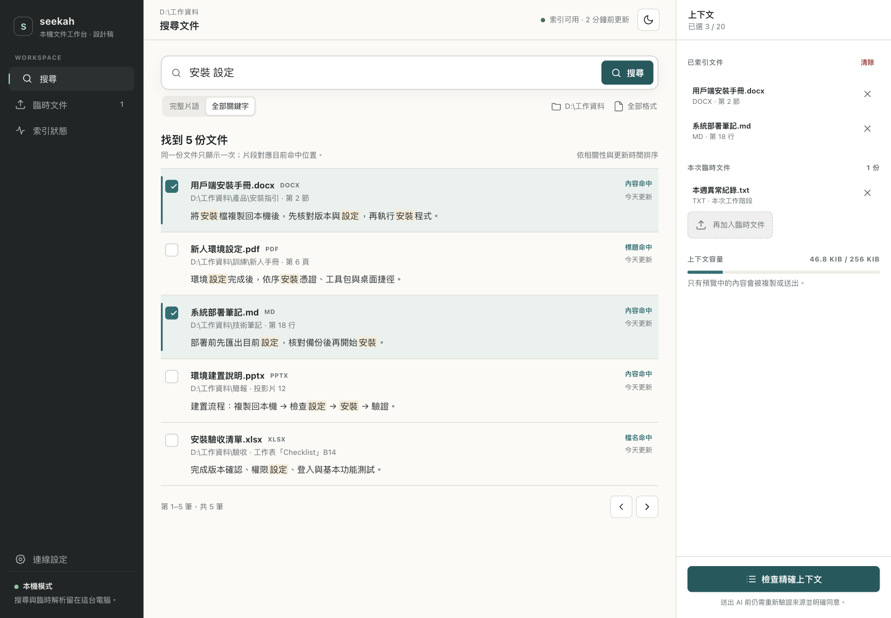
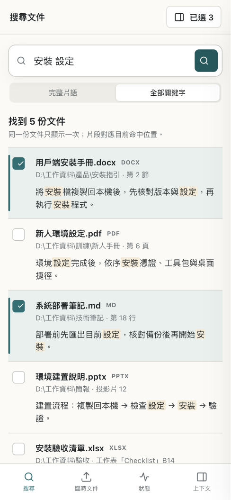

# Seekah 本機工作台 GUI 設計提案

狀態：2026-09-24 設計提案，**尚未套用到 `docsearch ui` 正式介面**。

互動設計稿：[seekah-workbench.html](seekah-workbench.html)。以瀏覽器直接開啟即可；只使用示範資料，不讀取索引、不開網路連線、不呼叫 AI API。

## 畫面預覽

### 桌面

### 行動版

## 問題

現有 0.35.0 工作台把搜尋、拖曳、Provider、確認、預覽與回答拆成六張等權卡片。功能完整，但主要工作流不清楚：

- 搜尋結果與選取狀態分離，使用者無法持續看到「正在組合什麼」。
- Provider 與 API Key 在尚未選到文件前就佔據主要畫面，安全確認反而被埋在後段。
- 實際上下文與 AI 回答長期佔用整列空白區域，首頁資訊密度低。
- 編號 1～4 暗示線性表單，但搜尋、拖曳與調整選取本來會反覆進行。
- 桌面版只有卡片網格，缺少文件工作台應有的結果區、上下文區與清楚的本機狀態。

## 決策

新版採三區工作台，而不是增加更多卡片：

1. **左側導覽**：搜尋、臨時文件、索引狀態。固定顯示本機模式，不把 Provider 當首頁主功能。
2. **中央工作區**：搜尋是主畫面；結果以分隔列呈現檔名、路徑、命中位置、片段與選取狀態。點列預覽，勾選只改上下文，不混淆兩種操作。
3. **右側上下文**：即時列出已選索引文件與臨時文件、容量和安全邊界。唯一主要動作是「檢查精確上下文」。

Provider、問題、同意與送出移到最後的檢查對話框。使用者先看實際文字，再決定只複製或送至外部 API。這保留既有 preview id、明確同意、20 份與 256 KiB 上限，不改資料契約。

## 視覺語言

- 延續 Seekah 核准的石墨、暖灰與青綠；桌面 GUI 使用紙白主工作區和深色導覽，不採高飽和藍色 SaaS 模板。
- 層級主要由空間、字重與分隔線建立；卡片只保留給真正獨立的狀態摘要，不把每個區塊都包成圓角容器。
- 青綠只標示主要動作、命中與選取；警告採暖琥珀色。顏色之外仍保留文字與圖示。
- 文件清單採高資訊密度但可掃讀的三層：檔名／格式、路徑／位置、命中片段。
- 深淺色共用同一資訊結構；不使用外部字型、圖片、CDN 或圖示套件。

## 主要狀態

- **搜尋**：完整片語／全部關鍵字、根目錄與格式範圍、零結果、選取、文件預覽。
- **臨時文件**：拖曳／選取、工作階段範圍、移除不影響來源。
- **索引狀態**：唯讀摘要、最後完整校正、問題數與最近活動；開啟此頁不觸發掃描。
- **上下文檢查**：顯示實際 Markdown、來源、bytes、Provider、問題與明確同意。未同意前不能送出。
- **行動版**：左側導覽改為底部四項；上下文改為可關閉抽屜；搜尋與結果維持主畫面。桌面 1120 px 以下也使用上下文抽屜，避免中央結果過窄。

## 原型互動

設計稿可操作：

- 搜尋示範文件、切換搜尋模式。
- 選取／取消文件，右側上下文與容量同步更新。
- 點擊結果查看文件命中預覽。
- 加入／移除臨時文件。
- 查看索引狀態。
- 開啟精確上下文、複製、切換 Provider 與確認送出。
- 切換深淺色，並在桌面與行動尺寸查看響應式版面。

「確認送出」只顯示設計稿提示，不會呼叫真實 Provider。正式實作仍必須重用 `searchDocuments`、`prepareContextTool`、現有拖曳 parser、loopback token／Origin／Host 防護與 HMAC preview 契約；不能從原型另寫第二套搜尋或安全邏輯。
